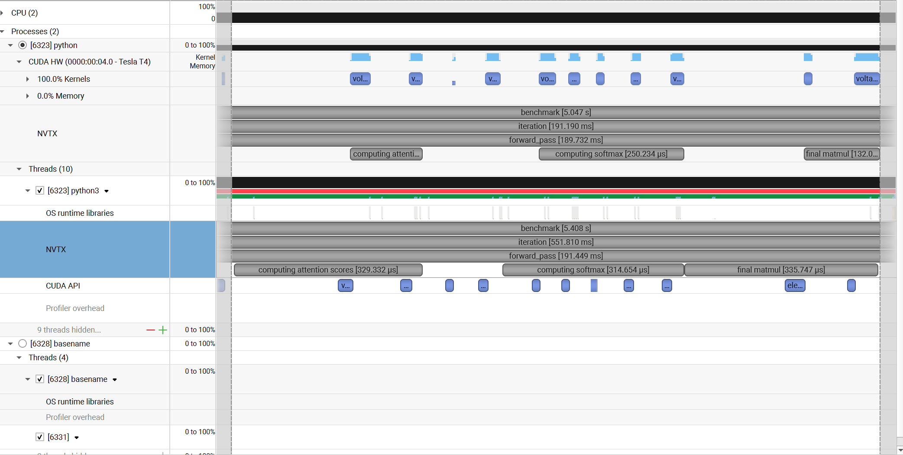

## Profiling and Benchmarking:

To make sure that what I optimize accounts for a good chunk of resources (time and memory),

I will start by implementing three performance evaluation paths:

1. A simple, end-to-end benchmarking using the Python standard library to time our forward and backward passes.
2. Profile compute with the NVIDIA Nsight Systems tool to understand how that time is distributed across operations on both the CPU and GPU:
   - Since I don't have GPU on my local machine, I will use a hybrid approach: Collect performance data in Kaggle using **CLI tools** and then analyze with GUI locally.
3. Profile memory usage.

We will use a vocab size of 10,000 and batch size of 4 in all experiments.

The model sizes are as follows:

| Size   | d_model | d_ff  | num_layers | num_heads |
|--------|---------|-------|------------|-----------|
| small  | 768     | 3072  | 12         | 12        |
| medium | 1024    | 4096  | 24         | 16        |
| large  | 1280    | 5120  | 36         | 20        |
| xl     | 1600    | 6400  | 48         | 25        |

**Table 1: Specifications of different model sizes**

### End-to-End Benchmarking:

We benchmarked the forward and backward passes for the transformer models described in the table below. 

Each run used **10 warmup iterations** followed by **10 timed iterations**,
and we report both the **mean** and **standard deviation** of the runtimes.
I used a context length of 128, and I could fit up to XL model;
the 2.7B was too big for my Tesla P100 (Kaggle free GPU).

#### Forward Pass Timings

| Model Size | Avg Time (s) | Std Dev (s) |
|------------|--------------|-------------|
| Small      | 0.035        | 0.005       |
| Medium     | 0.070        | 0.010       |
| Large      | 0.165        | 0.011       |
| XL         | 0.178        | 0.001       |

#### Backward Pass Timings

| Model Size | Avg Time (s) | Std Dev (s) |
|------------|--------------|-------------|
| Small      | 0.095        | 0.068       |
| Medium     | 0.190        | 0.056       |
| Large      | 0.360        | 0.052       |
| XL         | OOM          | OOM         |

> **Notes:**
> + we can see an almost linear scaling with model size for the forward pass,
> it increases with around 0.035 s between model sizes.  
> + The full pass (froward + backward) exhibits similar linear scaling (increases with 0.1 s with model size)
> + The backward pass takes around two times the forward pass (Aligns with scaling heuristics)
> + Runtime variability was minimal, with standard deviations remaining low,
> suggesting stable system performance once the model reaches a steady state (after warmup).
> + I couldn't fit the XL model for the full pass (gradients)

---

#### Effect of Omitting Warmup Steps

We repeated the benchmark **without war mup steps**, 
and observed significantly higher runtimes and greater variance.
For example, with no warmup iterations, 
model size medium goes from 0.19 s for the full run with warm up to 0.33 s without it,
and we notice very high variance of around 0.4 s!

This is mainly due to the fact that the first few iterations incur one-time costs such as CUDA kernel compilation,
memory allocations, and cache setup.

Even when using only **1 or 2 warmup steps**, the timings were still inconsistent. 
Reliable benchmarking requires enough warmup iterations 
to let the system reach a deterministic and cache-optimized execution state.

#### Mixed-precision training:
In mixed-precision training, we might use either FP32 or BF16 (Nobody seriously uses FP16).

The use of BF16 leads to less memory use (obvious) and to faster training (less obvious) 
because it leads to higher memory throughput, better cache utilization and register efficiency (among other more technical reasons).

My heuristical understanding on where to use FP32/BF16 is the following:

+ Weights should always be stored in FP32.  
  - In mixed‑precision training (e.g., NVIDIA AMP), a master copy of the weights lives in FP32.  
  - FP16/BF16 “shadows” are used in matmuls, but updates are applied to the FP32 master to avoid drift.

+ Mixed‑precision is used in both forward and backward passes, but noisy gradients don’t accumulate unchecked.  
  - Forward *and* backward matrix‑multiply kernels run in FP16/BF16.  
  - Gradients are immediately up‑cast (and loss‐scaled if using FP16) to FP32 before the weight update.

+ Noisy activations (from low precision) act like a tiny regularizer, but the main goal is speed and memory savings.  
  - Quantization noise is structured by mantissa rounding, not pure Gaussian.  
  - We benefit from it only because matmul errors average out over many terms.

+ We only tolerate noise where it can be averaged out by gradient sums.  
  - Independent errors in multi‑term reductions (e.g. dot‑products) cancel out.  
  - Single‑term or few‑term ops (norms, losses) can’t average out error and must stay in FP32.

+ In simpler terms:  
  + We can use BF16 in matrix multiplications because each output is a sum over many products, rounding errors average out.  
  + But for normalization or loss calculations, a single rounding error would bias the entire result, use FP32.

+ Systematic gradient corruption (single‑point failure) vs. random gradient noise (independent ops)  
  - This difference is what determines precision requirements for training stability.

For my experimentation with mixed-precision training, I switched to T4 GPU since P100 doesn't have 
specialized Tensor Cores for BF16/FP16.

Unfortunately, T4 doesn’t support BF16, so I used FP16 instead, I didn’t include scaling, which would be used in proper training scenarios, 
to keep focus on pure computing benchmarking.

These are the results of the full training pass, with the same parameters as before (Both recorded on T4)

| Model Size | Avg Time FP | Avg Time with MP |
|------------|-------------|------------------|
| Small      | 0.121       | 0.106            |
| Medium     | 0.243       | 0.192            |
| Large      | 0.517       | 0.388            |

> **Notes:**
> + As expected, mixed-precision training leads to better performance; although even 
> with mixed-precision, it's still suboptimal compared to P100 with Full precision.
> This might be because certain operations still execute in FP32 (Where P100 has higher peak throughput).
> + Another caveat is that mixed-precision used more memory, probably because we still store a master copy of the weights.
> + The difference in performance becomes bigger as model size gets bigger (better hardware utilization)

### Nsight Systems Profiler:

I started by profiling the large model with context length of 128. Overall statistics when running only the forward pass:

#### Forward pass:

##### CUDA Timeline Breakdown

| Row         | What It Shows                               | Observations                                           | Interpretation                                |
|-------------|---------------------------------------------|--------------------------------------------------------|-----------------------------------------------|
| **CUDA HW** | Actual GPU kernel execution                 | 78.5% compute, 21.5% memory (mostly 99.2% H2D upfront) | GPU is busy, memory not a bottleneck          |
|             |                                             | Small gaps (`~0.002–0.004 ms`)                         | Minor idle period. good utilization           |
| **CUDA API**| Host-side kernel/mem launches               | Gaps up to `~0.3 ms` between calls                     | CPU-side dispatch overhead can be significant |

Now, some specifics for one forward pass:

- **Forward pass time**: `162.137 ms` (matches previous benchmarking results)
- **Kernel launches per forward**: `2,565`
- **GPU utilization**: **Good**. Kernels densely packed in CUDA HW row
- **Launch overhead**: Somewhat notable. Gaps in CUDA API go up to `0.3 ms`
- GEMM accounts for `~63%` of total forward time `(102 ms / 162 ms)`

---

##### Top 3 Kernels (by total time)

These results are filtered for one forward pass:

| Name                            | Calls | Avg Time | Time % | std    | Notes                             |
|---------------------------------|-------|----------|--------|--------|-----------------------------------|
| `volta_sgemm_128x64_tn`         | 253   | 406.8 µs | 81.6%  | 217 µs | Main matrix multiplications       |
| `vectorized_elementwise_kernel` | 72    | 64.9 µs  | 3.7%   | 1 µs   | Fused/optimized pointwise ops     |
| `elementwise_kernel`            | 434   | 10.4 µs  | 3.4%   | 2 µs   | Pointwise ops (likely activations)|

As expected, GEMM kernel dominates computation but elementwise kernel adds noticeable overhead

>Final notes
> + There are many kernel launches, indicating the need for fused operations. This would reduce the number of launches and thereby minimize CPU dispatch overhead.
> + I noticed significant std for the GEMM kernel time estimation, this might be due to the small batch size, which leads to non-optimal kernel selection.

#### Full pass:

Same config and hyperparams as before, now with the full pass:

##### CUDA Timeline Breakdown

| Row         | What It Shows                               | Observations                                          | Interpretation                                |
|-------------|---------------------------------------------|-------------------------------------------------------|-----------------------------------------------|
| **CUDA HW** | Actual GPU kernel execution                 | 91.5% compute, 8.5% memory (mostly 95.6% H2D upfront) | GPU is busy, memory not a bottleneck          |
|             |                                             | Small gaps (`~0.002–0.004 ms`)                        | Minor idle period. good utilization           |
| **CUDA API**| Host-side kernel/mem launches               | Gaps up to `~0.3 ms` between calls                    | CPU-side dispatch overhead can be significant |

During kernel execution (forward and backward) we only have `Memset` memory operations.

Now for specifics:

- **Full pass time**: `525.12ms`, of which forward pass (`172 ms`) and backward pass (`262.8 ms`)
- **Kernel launches per forward**: `2,565`, **Kernel launches per backward**: `4279` 

Details for the forward pass are the same as before. We will focus on the backward pass now. 

##### Top 3 Kernels (by total time)

Results are filtered for one backward pass:

| Name                    | Calls | Avg Time   | Time % | std    | Notes                                           |
|-------------------------|-------|------------|--------|--------|-------------------------------------------------|
| `volta_sgemm_128x64_nn` | 191   | 420.8 µs   | 31.4%  | 276 µs | First matrix multiplications  (same dimensions) |
| `volta_sgemm_128x64_nt` | 191   | 64.9 µs    | 31.4%  | 278 µs | Second matrix multiplication  (diff dimensions) |
| `elementwise_kernel`    | 382   | 271.192 µs | 23.1%  | 20 µs  | Point wise ops (likely activations)             |

> Notes
> + Backward pass takes approximately two times as much as the forward pass; we can see clearly that this is because 
> when backpropagating we do two matrix multiplies (for each parameter, two derivatives).
> + We can still notice that matrix multiplication has a big standard deviation and the same as before the number of calls 
> to launch kernels is significant. Again, we need to look into how to fuse.
> + In contrast to the forward pass, `elementwise_kernel` takes significant time, probably because 
> the SwiGLU derivative is somewhat complex and the lack of fusion.

#### Deep-dive into attention:

If we look at this filtered part, which represents one attention calculation (for one layer), 
under forward pass we can find `num_layers` attention computations.

Let's start with an overview analysis, we can notice the following:
+ Each operation takes about half its execution time in the CPU, the actual computations in the GPU are rapid. 
+ We can see clearly how when a CPU launches a kernel it gets executed instantly.
+ We can also notice that it takes a significant time between the GPU finishing a kernel and the CPU launching the next.
+ Calculating the softmax takes the same time as calculating the first matrix (large one)
+ The missing annotation is for the masking part.

Now, in more details:
+ Attention calculations take around `1230 µs` (on average).
+ All three operations, first matmul, softmax and final matmul take approximately the same time `330 µs`, although this changes greatly between layers, 
the rest is for masking operation.
+ Matrix multiplication is achieved with two Kernel calls  `volta_sgemm_` and a `vectorised_elementwise`.
+ In contrast, the softmax operation, **takes five Kernels!**, this is a lot and screams for the need to fuse.
+ The pure calculation in the GPU takes only `500 µs`.

> Main results:
> + Running one attention head takes 11 kernel launches, 5 of which are for softmax alone.
The GPU executes in ~500 µs, but due to CPU dispatch latency, the total time rises to ~1230 µs.
If we could fuse the entire attention computation into a single composite kernel, we could halve the total runtime.
> + **Softmax is around two times less expensive than Matrix multiplications in terms of FLOPs, but it still takes around the same time!**

