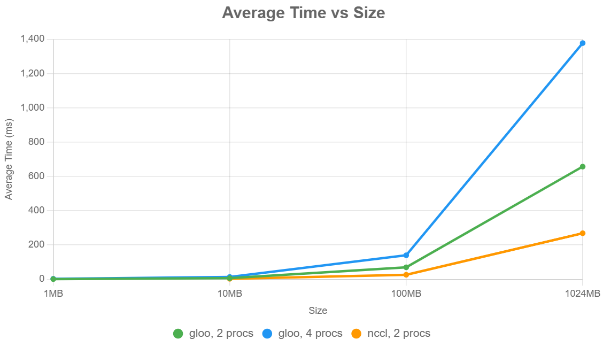
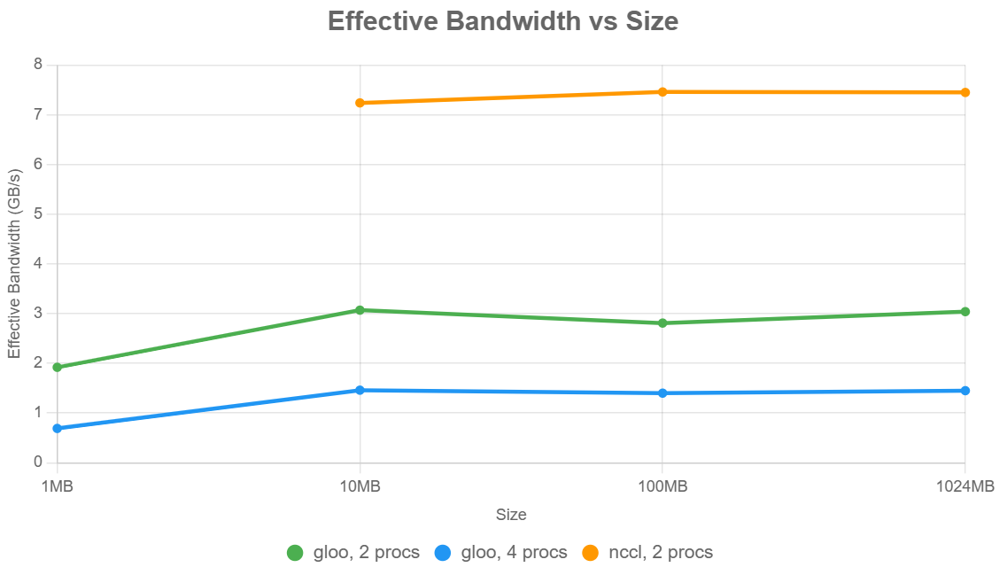

# Distributed Data Parallel Training

## Benchmarking Distributed Applications:

To better understand the overhead of communication in distributed training.
I started by benchmarking the all-reduce operation, which is arguably the most used communication operation.

I followed best practices for benchmarking distributed applications including:
1. All benchmarks are run on the same machine for controlled comparisons.
2. I perform several warm-up steps, especially important for NCCL communications.
3. I use `torch.cuda.synchronize()` to wait for CUDA operations to complete when benchmarking on GPUs.
4. I aggregate measurements across ranks to improve estimates.

I started by first debugging locally with Gloo on CPU and then benchmarked on Kaggle with NCCL on GPU.

I used the following settings:
+ Backend + device type: Gloo + CPU, NCCL + GPU.  
+ Data sizes: float32 data tensors ranging over 1MB, 10MB, 100MB, 1GB.  
+ Number of processes: 2, 4, or 6 processes.

On GPU, I only had access to two T4 GPUs on Kaggle.

Results were as follows: 

| Backend      | Processes | Size   | Avg Time (ms) | Effective Bandwidth (GB/s) |
|--------------|-----------|--------|---------------|----------------------------|
| gloo (CPU)   | 2         | 1MB    | 1.0172        | 1.92                       |
| gloo         | 2         | 10MB   | 6.3603        | 3.07                       |
| gloo         | 2         | 100MB  | 69.6140       | 2.81                       |
| gloo         | 2         | 1024MB | 657.1070      | 3.04                       |
| gloo         | 4         | 1MB    | 2.8166        | 0.69                       |
| gloo         | 4         | 10MB   | 13.3875       | 1.46                       |
| gloo         | 4         | 100MB  | 139.9087      | 1.40                       |
| gloo         | 4         | 1024MB | 1377.8717     | 1.45                       |
| nccl   (GPU) | 2         | 10MB   | 2.6964        | 7.24                       |
| nccl         | 2         | 100MB  | 26.1726       | 7.46                       |
| nccl         | 2         | 1024MB | 268.5016      | 7.45                       |


To visualize the benchmarking data, I created two charts: one for Average Time (ms) and one for Effective Bandwidth (GB/s), 
both grouped by Backend and Processes, with Size as the x-axis.

###### **Average Time (ms) Chart:**



###### **Effective Bandwidth (GB/s) Chart:**




>Notes:
> + Average time scales linearly both when we increase the data size and the number of processes.
> + For example, we can see that when we go from two processes to four on the CPU, the total time doubles.
> + Same for the data size,within the same number of processes (factor of 10)
> + I don't have GPU resources to check if this trend persists, but I assume it does.
> + The effective bandwidth stays consistent for the same number of processes as we increase the data size (except for 1MB), this means we're at the peak throughput.
> + For a different number of processes, the effective bandwidth decreases as we increase the number (at least for the CPU)
> + For the same settings, GPU is consistently faster than CPU, highlighting NCCL superior performance 

Caveats and engineering details:
+ I couldn't use TCP to initialize processes on my machine (Windows), I used a local file instead for local testing, I switched to TCP for actual benchmarking in Kaggle.
+ `dist.all_gather_object` causes deadlocks, I still don't know why, but I used `dist.gather` instead (I wasted a lot of time trying to make it work)


## Data Parallel Training:

This is one of the four methods of parallelism (DP, FSDP/TP, PP, EP), and arguably the simplest one.
It allows for bigger batch sizes, something important for stable transformer training. 

> Premise: Batches of data are split across multiple devices, and each device computes gradients for their own batch. 
> These gradients are then averaged across devices.

### Naive DDP:
For naïvely doing distributed data parallel training, we communicate gradients to average after we finish calculating 
the full backward pass, and we communicate gradients one parameter at a time.

You can find implementation under `systems/ddp_training/naive_ddp`.

To benchmark this solution,
I used the medium model size configuration (biggest I could fit) from `systems/configs/model_sizing.YAML`
with batch size 32 and context length 64, I ran experiments on Kaggle using 2 * T4 GPUS.

Results for benchmarking this implementation were as follows:

```
Started benchmarking naive DDP
------------------------------------------------------------
  -> Avg Time for full training step: 1406.7442 ms | Avg for reduce operation: 498.0934 ms (35.4%)
------------------------------------------------------------
 Finished benchmarking naive DDP
```

We can notice two things a large amount of time is spent in communication, which adds significant overhead;
this overhead would be even larger for bigger models (more gradients to communicate).

There are two solutions to improve this naive approach:
+ Reduce the number of communication calls by flattening gradients from all parameters and doing one reduce operation.
+ Overlap communication of parameters with backward pass computations (all-reduce parameter gradients as soon as they’re ready)

We will implement each optimization strategy at a time and see what it yields.

## DDP with flattened tensors:

This is a straightforward implementation, `systems/ddp_training/minimal_ddp_flat_benchmarking`. 

The results for benchmarking using the same setup as before were as follows:

```
 Started benchmarking DDP with flat tensors
------------------------------------------------------------
  -> Avg Time for full training step: 1365.1573 ms | Avg for reduce operation: 500.2333 ms (36.6%)
------------------------------------------------------------

 Finished benchmarking  DDP with flat tensors
```

This shows no improvement over the previous version. 
This is because we are in **bandwidth-bound** regime

Let's say we’re sending $P$ parameters, each of those sends incurs its $\alpha$ startup latency. 
The per-byte cost (bandwidth) is $\beta$, so for $n$ bytes:

$$ T(n)= \alpha \cdot P + \beta\cdot n $$

Once we’re sending (even moderately large) chunks of data, which the parameters are, $$ dominates 
so heavily that splitting into several doesn’t noticeably change the end‑to‑end time.

## DDP with overlap: 

We will communicate gradients as soon as they’re computed by the backward pass,
this way we can overlap computation with communication.

Implementation is in `systems/ddp_training/ddp_overlap_individual_parameters`. 
It contains a wrapper that asynchronously all-reduces individual parameter tensors. 

We use two concepts Backward hooks and Asynchronous communication.

The results for benchmarking using the same setup as before were as follows:

```
 Started benchmarking DDP with overlap and individual parameter communication
------------------------------------------------------------
  -> Avg Time for full training step: 1075.7339 ms | 
------------------------------------------------------------

 Finished benchmarking  DDP with overlap and individual parameter communication
 ```

Great, we can see an improvement; our training step now is 28% faster!


## DDP with bucketed overlap:

To get the best of two worlds, we will implement overlap with bucketed communication.
We will organize our parameters into buckets (reducing the number of total communication calls)
and all-reducing buckets when each of their constituent tensors is ready
(enabling us to overlap communication with computation).

Implementation is in `systems/ddp_training/ddp_overlap_bucketed`.

We will benchmark using the same experimental setup as before varying 
the maximum bucket size (1, 10, 100, 1000 MB).


Results were as follows: 

```
------------------------------------------------------------
Bucket size: 1 MB
  -> Avg Time for full training step: 1093.3777 ms | 
------------------------------------------------------------
------------------------------------------------------------
Bucket size: 10 MB
-> Avg Time for full training step: 1120.0995 ms | 
------------------------------------------------------------
------------------------------------------------------------
Bucket size: 100 MB
  -> Avg Time for full training step: 1213.3543 ms | 
------------------------------------------------------------
------------------------------------------------------------
Bucket size: 1000 MB
  -> Avg Time for full training step: 1360.4418 ms | 
------------------------------------------------------------
```

Results from running the profiler in `systems/ddp_training/ddp_overlap_bucketed_profiling.py` 
show this when it comes to all_reduce calls:

+ 1 MB: 1700 calls, 2.745ms per call, total 4.667s 
+ 10 MB: 980 calls, 4.425ms per call, total 4.336s 
+ 100 MB: 150 calls, 28.522ms per call, total 4.278s 
+ 1000 MB: 20 calls, 214.857ms per call, total 4.297s

This aligns with the previous analysis, we're in the **bandwidth-bound** regime

The increase in time is expected because 
**Larger than ideal buckets lead to less overlap with computation since we need more gradients to start the all-reduce operation.**

So we would need to find the sweet spot, one question I had was if the latency caused by calls
is so small, specially in modern hardware, why don't we just communicate one parameter at a time?

Online sources mention that this leads to complex scheduling (many allocations and deallocations) and driver bookkeeping on the host.

So buckets strike the sweet spot between **too many tiny calls** (high overhead and complex scheduling) and 
**one giant monolith** (poor overlap opportunity).

We can formulate an equation to model the DDP overhead and the optimal model size. 


> Note:
> In my current implementation, there's an overhead of allocating/deallocating tensors for flattening and unflattening;
> a better option would be to allocate persistent contiguous buffers for each bucket. 


### On global batch size:

Global batch size is given by the equation: ```bs=gbs=mbs×grad_acc×dp```

Here, `grad_acc` is the number of gradient accumulation steps, and `dp` is the number of parallel instances used for data parallelism.

Given a targeted global batch size, we can thus trade gradient accumulation steps for data-parallel processes to speed up training.

In practice, people tend to maximize the data-parallel size (dp) over gradient accumulation (grad_acc) as much as possible since data parallelism is inherently parallel, 
unlike the sequential nature of gradient accumulation. 
Gradient accumulation is then added on top of data parallelism to achieve the target global batch size, 
when scaling data parallelism alone is not sufficient before you run out of GPUs.

Being able to distribute the training over different samples gives us a first dimension of parallelization, thus making this 1D parallelism.

The other types of parallelism are much more complex to implement.


## Communication accounting:

> **Context:**
> Consider a new model config, XXL, with d_model=16384, d_ff=53248, and num_blocks=126. 
> Because for very large models, the vast majority of FLOPs are in the feedforward networks, 
> we make some simplifying assumptions. First, we omit attention, input embeddings, and output linear layers. 
> Then, we assume that each FFN is simply two linear layers (ignoring the activation function), 
> where the first has input size d_model and output size d_ff, and the second has input size d_ff and output size d_model. 
> Your model consists of num_blocks blocks of these two linear layers. Don’t do any activation checkpointing,
> and keep your activations and gradient communications in BF16, while your accumulated gradients, master weights and optimizer state should be in FP32.

##### 1. Overall memory usage:

In this simplified setup, we have $N = 2 * `num\_{blocks}` (`d\_{model}` * `d\_{ff}`)$.

Calculating the memory usage for the master weights and accumulated gradients is straightforward:

$`m\_{grads_fp32}` = 4 * N =  ~818 GB$
$`m\_{params_fp32}` = 4 * N = ~818 GB$

This alone needs around 11 H100 GPUs without accounting for the optimizer states and the activations.

Activations depend on the input shape given by [batch_size, seq_len, d_model]. 
The number of activations would be then $`N\_{activations}` = `num\_blocks` * `batch\_size` * `seq\_len` * (`d\_model` + `d\_ff`)$

The memory footprint would be given by: $`m_{activations}` = `N\_{activations}` * 2$, this scales linearly with batch size and sequence length.


#### 2. FSDP sharding:

To deal with the memory footprint, we can use FSDP to shard the model, optimizer states, gradients and half of the activations.

If we wanted to calculate how many devices we would need so the memory cost can fit on one GPU, we can use the formula:

$`m\_{device}` = (4N + 8N + 4N) / `N\_{FSDP}` + (`batch\_{size}` × `seq\_{len}` × 17,543,808) / `N\_{FSDP}`$
