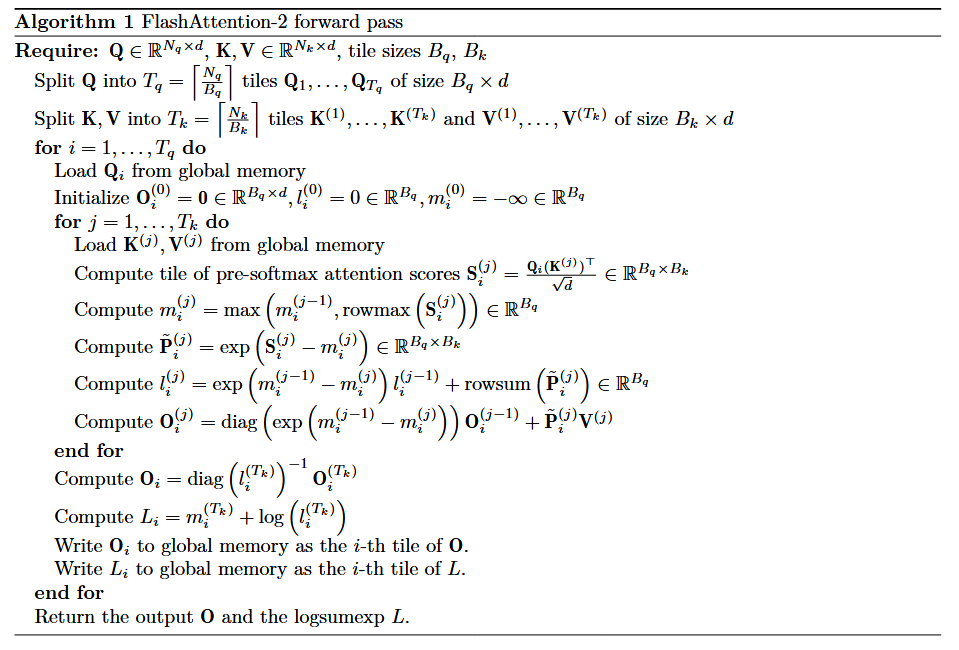

# Flash Attention

## Flash attention Forward pass

This is the pseudocode for FlashAttention:



At first, it looked intimidating, but it's straightforward when you understand it; this is how
I think about it:
1. There are two loops, the outer one is parallel, meaning each thread block will be working on a $B_q$
rows of the overall $Q$ matrix.
2. The inner loop is *sequential*, each thread block will go through all the $T_k$ keys and values, one by one, to finally write the $B_q$ rows of $O$
3. Each time we load a new key and value, we calculate the similarity score between our queries (always loaded) and the newly loaded keys.
4. We update the maximum value of each row with new calculated similarities, we save them into vector $m$.
5. We will use the correction term to recalibrate with the new maximum value
6. We calculate the *unnormalized* similarity matrix $P$ (we add $B_k$ portion at each step of the loop).
7. We accumulate the new similarity matrix entries into the running sum $l$.
8. Finally, we load the rows in the output we’re responsible for, we start by correcting with new max, and then we add the new portion of weighted values.
9. We finish by normalizing the output with the running sum (we factorized the normalization until the end)

> Note: 
> The difference between FlashAttention 1 and this version is that in FlashAttention 1, we parallelize **only** over the *batching dimensions* (batch and head).
> If we implement FlashAttention 1, each block will run the two loops sequentially. Here we parallize the leading dimensions *and* across sequence length; 
> this is how we avoid the quadratic complexity.

### Triton code:

Triton was straightforward; I think the most important parts to understand were:
1. We need to launch our kernel using a grid, you think of this grid as the output, the output is parallelized,
so the grid we launch with should match the dimensions of the output we want to parallelize. 
For example, in attention the output has shape `B x L x D`, we want to parallelize the output along the batch and sequence length, so we launch a grid with two arguments, the number of batches and the number of tiles for L.
This way we take great advantage of parallelization, if we wanted to have a head dimension we would launch with three arguments.
2. Each block will get an identical copy of our kernel, to know what block it will execute we need to do pointer arithmetic since the only thing we have that is distinctive between blocks is their id. **Everything needs to be contiguous**.
3. Inside each block, we will write code sequentially. Different operations are executed differently:
   + SIMD / Warp-Executed Operations: Most of our operations, these operations are executed in a warp (32/64 threads) all in parallel, this includes operations like: `tl.arange`, `tl.load`, `tl.dot`, `tl.where`, allocations, elementwise operations and atomic operations .SIMD operations perform best when:
       + Have colaeced memory access (`tl.load`/`tl.store`).
       + Avoid thread divergence by using control flow statements, we need to construct it carefully adn only use conditionals with `tl.constexpr`.
       + Avoid overusing allocations (`tl.zeros` ...) which can silently fall back to global memory and hurt perf.
       + Avoid atomic ops on memory, as they need access to global memory.
   + Non-SIMD operations include pointer arithmetic utilities `tl.make_block_ptr`, `tl.advance`

Apart from these concepts, the rest is straightforward and just follows basic python syntax, some nuances I encountered:
1. tl.make_block_ptr makes pointer arithmetic very straightforward, syntax is the following:
    ```python
     Q_block_ptr = tl.make_block_ptr(
                Q_ptr + batch_index * stride_qb, # pointer for the top-left element adjusted for batch 
                shape=(N_QUERIES, D), # Overall shape (All of Q), this is used for boundary check (before make_block_ptr, we would handle this by creating masks)
                strides=(stride_qq, stride_qd), # This stride is used to construct the tensor of pointers
                offsets=(query_tile_index * Q_TILE_SIZE, 0), # This is the starting position
                block_shape=(Q_TILE_SIZE, D), # Size of the tile we are working on (before make_block_ptr, we would use these with`tl.arange`)
                order=(1, 0)) # row-major or column-major
    ```
2. memory order is important, it defines which dimension changes fastest.
   + Row-Major (order=(1, 0)) means that memory is laid out such that elements along the last dimension (D) are contiguous.
   + Column-Major (order=(0, 1)) means that memory is laid out such that elements along the first dimension (Q_TILE_SIZE) are contiguous.
   + PyTorch uses row-major memory layout, this is crucial for optimizing triton code. 
   + Naively in my implementation, I thought that loading the K matrix directly transposed would allow for better performance, but this wasn’t the case; GPUs perform best when memory accesses are coalesced, 
     meaning consecutive threads access contiguous memory locations. A better approach was to load data normally and then transpose it; I compared between the two approaches below.
   + Triton makes memory coalescing straightforward, when using PyTorch tensors which are stored in row-major order by default, just align `tl.make_block_ptr` configuration with the row-major layout, 
     and you can ensure efficient, coalesced memory accesses on the GPU.
   + For more advanced memory coalescing, `tl.align` is handy.
3. to avoid precision issues: 
   + On chip buffers should have `dtype` `tl.float32` specially if we want to use them as accumulaters.
   + It's best practice to cast matrices to the same `dtype` before multiplying them or when storing.
   + There aer cases of silent overflow/underflow if inputs are float16 or bfloat16, sometimes it's best practice to analyze critical paths manually.

### Code and benchmarking:

My code for flash attention is in ``, I will try to optimize it form the current naive version and benchmark along the way (see commit history).
Performance will be measured on T4 with batch size 1, sequence length 16,384 for queries, keys, and values, and `d_model` = 64.

I started by using a fixed tile sizes 64, 64

Benchmarking code can be found here `` and I used `triton.testing.do_bench`

The naive implementation baseline had these quantiles for the forward pass: ` [45.79351577758789, 46.07843017578125, 46.288665008544925]
`
#### Improving memory-collecing

In my first implementation, I thought that loading K transposed would be better for perf, but I noticed how this wasn't a smart move when I read about memory coellecing.
After loading K using the original raw-major layout and then transposing, performance improved to: `[45.77628707885742, 46.046207427978516, 46.29094314575195]`.

This was an insignificant improvement which might be due to the T4 architecture or the small `d_model` and tile size that allows the T4’s L1/L2 caches to service strided accesses efficiently.

I will stick with this implementation since it's theoretically saner. 

#### Using better masking:
